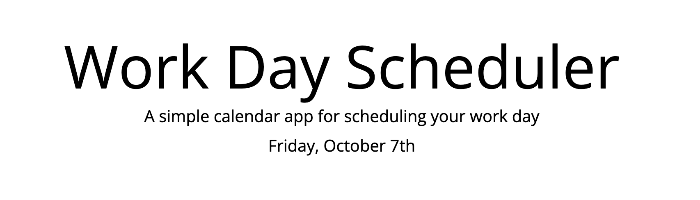

# Work Day Scheduler

## Purpose
The purpose of this scheduler is so that the user can input to-do items hour-by-hour from 9am to 5pm and save their items in the local storage, so the data stays put even on page refresh. 

The user will see the title at the top of the page with a description and todays date. Todays date is provided by the use of Moment.js.

## Code
HTML - Mostly using bootstrap, this table was developed and styled. There were a few custom styling elements that are found in the local CSS file for colors, etc. 

JS - Utilizing a few different JQuery techniques this code was able to be shortened quite a bit. In order to get the table content in the middle color coded by past, present and future styles I used a JQuery technique to add class to elements depending on what time of the day they fell into - past, present or future. 

(GitHub Challenge 5 Live Site)(https://drewsparker.github.io/challengeFiveSchedule)

## Future Enhancements
- An element that I thought could be added was a 'clear all' button for the user to quickly scrape the scheduler clean. 